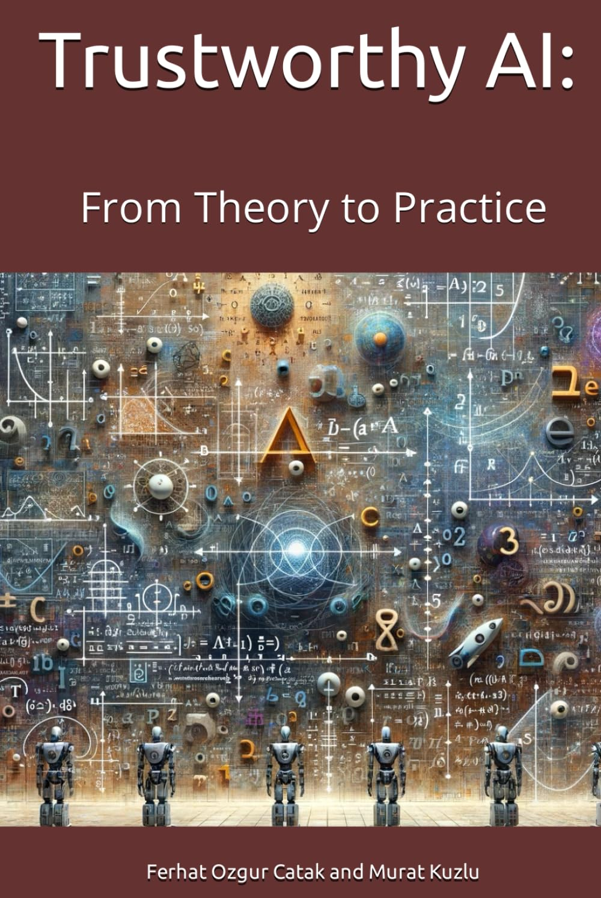

# Trustworthy AI: From Theory to Practice

## About the Book

"Trustworthy AI: From Theory to Practice" is a comprehensive guide focused on implementing and developing AI models that adhere to the principles of trustworthiness, including privacy, security, and robustness. Through practical implementations and examples using Python, this book aims to equip readers with the skills and knowledge necessary to integrate these crucial aspects into AI projects. It covers a wide range of topics, from uncertainty quantification and adversarial machine learning to privacy-preserving techniques like federated learning and homomorphic encryption, providing a solid foundation for building ethical and reliable AI systems.

## Access the Book

You can find "Trustworthy AI: From Theory to Practice" on Amazon to get a physical or Kindle copy of the book. Here is the link to the Amazon page:

["Trustworthy AI: From Theory to Practice" on Amazon](https://a.co/d/hp2F8GP)

## Repository Structure

This repository is organized by chapters, with each chapter having its own subfolder, such as `Chap-2`, `Chap-3`, etc. Inside each chapter's folder, you will find Python notebooks, scripts, and resources related to the topics covered in that chapter. Please note that Chapter 1 does not include code as it serves as an introduction to the concepts of Trustworthy AI.

- `Chap-1`: Introduction to Trustworthy AI (No code examples)
- [`Chap-2`](Chap-2): Reliability: Uncertainty Quantification in Artificial Intelligence
- [`Chap-3`](Chap-3): Security of Artificial Intelligence: Adversarial Attacks
- [`Chap-4`](Chap-4): Transparency and Explainability
- [`Chap-5`](Chap-5): Privacy-Preserving Artificial Intelligence: Federated Learning
- [`Chap-6`](Chap-6): Privacy-Preserving Artificial Intelligence: Homomorphic Encryption
- Additional resources and updates can be found in the respective chapter folders.

## Getting Started

To get started with the code examples in this repository, we recommend setting up a Python environment with the required libraries. Most examples can be run in environments like Jupyter Notebooks or directly as Python scripts. Ensure you have Python 3.x installed along with libraries such as `numpy`, `scipy`, `matplotlib`, `tensorflow`, `keras`, `Cleverhans`, `PyFHEL`, `sklearn`, and others as required by specific chapters.

## Contributing

We welcome contributions from the community, whether it's in the form of bug fixes, improvements to the existing code, additional examples, or documentation updates. Please feel free to fork the repository, make your changes, and submit a pull request.

## Contributors

- [Ferhat Ozgur Catak](https://github.com/ocatak) 
- [Murat Kuzlu](https://github.com/muratkuzlu) 

## License

This project is licensed under the MIT License - see the [LICENSE](LICENSE) file for details.

## Acknowledgements

This book and the accompanying repository have been made possible by the collaborative efforts of the course [`DAT945: Secure and Robust AI Model Development`](https://www.uis.no/en/course/DAT945_1) at the University of Stavanger, Norway, and the support from [NORA.AI](https://www.nora.ai), the Norwegian Artificial Intelligence Research Consortium. We extend our gratitude to all contributors and supporters of this project.
